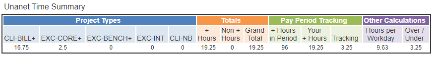
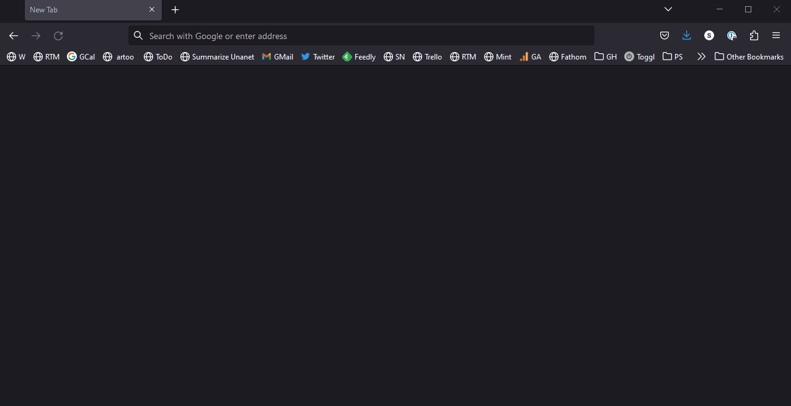

# unanet-summarizer

| Latest Build                                                                                                                                                                                                                              | Deployment                                                                                                                                                                                                  |
| ----------------------------------------------------------------------------------------------------------------------------------------------------------------------------------------------------------------------------------------- | ----------------------------------------------------------------------------------------------------------------------------------------------------------------------------------------------------------- |
| [](https://dev.azure.com/excellaco/unanet-summarizer/_build/latest?definitionId=5&branchName=master) | [](https://dev.azure.com/excellaco/unanet-summarizer/_release?definitionId=1) |

A link that you can add to any browser's bookmarks which adds a summary and some time-keeping helpers to your unanet timesheet page.



## For Users

### Purpose

We (and our supervisees) sometimes have a lot of time entry categories. It may be difficult to understand a high-level view of these entries at a glance.

The Unanet Summarizer allows you to:

* View your summary of time entries by time (INT, CORE+, BILL+, etc.)
* See how "over/under" you are for a given time period
  * ...and carry over the first timesheet's number to your second timesheet so you can see for the month
* Avoid using more PTO than you need to by seeing if you're over on `+` hours in a time period where you use PTO
* Quickly summarize your supervisees' timesheets to see where their hours land (and watch for signs of overwork/burnout, etc.)

### How to Get the Bookmarklet

Drag the link below to your browser's bookmarks or bookmark toolbar (you can rename it afterward, if you want)

<a href="javascript:(function(){ var onload=function(){ window.summarizeUnanetTime(); }; if(!window.summarizeUnanetTime){var s=document.createElement('script');s.src='https://excellalabs.github.io/unanet-summarizer/unanet-summarizer.js';s.onload=onload;document.body.appendChild(s)} else { onload(); } })();">Summarize Unanet</a>

Here's an animation of how that might work in a Firefox browser:

> 

### How to Use the Bookmarklet

When you're on your timesheet (or viewing your supervisees' timesheet), click the bookmarklet link to see the time summary.

> 

### Common Questions

#### Q: What's a Bookmarklet?

A: Most bookmarks point to a web site (e.g. <https://excellalabs.com>). A _bookmarklet_ actually contains some script that manipulates a web page in some way. In our case, that script downloads the unanet-summarizer code and runs it, which displays the summary box on the web page.

#### Q: What do you mean by my browser's bookmarks toolbar?

A: On many browsers, you can display a "bookmarks bar" below the main place where you enter web sites / searches. This lets you click on a bookmark directly, without going through your "bookmarks" or "favorites" folders. It makes things a little more accessible.

## For Developers / Coders

### How it Works - Behind the Scenes

* The bookmarklet loads our script.
* This script scrapes the DOM in the web page to capture time entries and places them into an array
* It then uses several reducers to summarize the time in various ways
* It uses some rudimentary string templates to put together some contents
* It then puts those contents into a new section which it renders on top of the timesheet.

### How We're Deploying This

* We first developed a JavaScript that could be executed in the browser's console
* We then served that from GitHub pages (thanks, GitHub!)
* We then created a bookmarklet that can load the script and execute it

### Explaining the Bookmarklet

The contents of the link are:

```
javascript:(function(){ var onload=function(){ window.summarizeUnanetTime(); }; if(!window.summarizeUnanetTime){var s=document.createElement('script');s.src='https://excellalabs.github.io/unanet-summarizer/unanet-summarizer.js';s.onload=onload;document.body.appendChild(s)} else { onload(); } })();
```

This bookmarklet adds injects the JavaScript file if it doesn't exist, and then calls the `summarizeUnanetTime()` function that it contains.

## Contributing to the Project

### How to build locally

* Pull this repository
* `cd bookmarklet`
* `npm install` gets the dependencies
* `npm run build` builds & outputs to `dist` folder

### How to test locally

* `npm start` allows you to view a bookmarklet for debug that you drag to your bookmarks bar
* open unanet
* edit a timesheet
* click the debug bookmarklet

### To Run the PowerBI analytics

* Download the PowerBI file (Azure --> `unanet-summarizer` RG --> `unanetsummarizer` storage account --> `analytics-powerbi` container --> `UnanetSummarizer.pbix`
* Open the powerbi file
* If prompted for the storage URL, use `https://summarizeranalytics.table.core.windows.net/analyticsentries` (the table storage within the `summarizeranalytics` storage group)

### A note on our build & release process

* The build and deployment steps run within Azure DevOps (status linked from this README file)
* A release is created upon a successful build
* The release is automatically pushed to production. By this, we mean the built JS output is pushed into the blob that we're using to serve the content.
