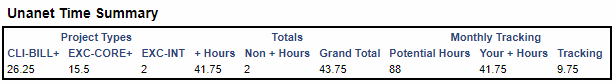

# unanet-summarizer

[](https://dev.azure.com/excellaco/unanet-summarizer/_build/latest?definitionId=5&branchName=master)

A JavaScript file that powers a bookmarklet to summarize some time-keeping helpers.



## Get the Bookmarklet

Drag this link to your browser's bookmarks or bookmark toolbar (you can then rename the title to what you want)

<a href="javascript:(function(){ var onload=function(){ window.summarizeUnanetTime(); }; if(!window.summarizeUnanetTime){var s=document.createElement('script');s.src='https://excellalabs.github.io/unanet-summarizer/unanet-summarizer.js';s.onload=onload;document.body.appendChild(s)} else { onload(); } })();">Summarize Unanet</a>

## How the tool works

* This script scrapes the DOM for the time entries and places them into an array
* It then uses several reducers to summarize the time in various ways
* It uses some rudimentary string templates to put together some contents
* It then puts those contents into a new document which it opens in a new tab.

Once you add the bookmarklet, you can click it while you're editing a Unanet timesheet and see the summary.

## How We're Deploying This 

* We first developed a JavaScript that could be executed in the browser's console
* We then served that from GitHub pages (thanks, GitHub!)
* We then created a bookmarklet that can load the script and execute it

## Explaining the Bookmarklet
The contents of the link are:

```
javascript:(function(){ var onload=function(){ window.summarizeUnanetTime(); }; if(!window.summarizeUnanetTime){var s=document.createElement('script');s.src='https://excellalabs.github.io/unanet-summarizer/unanet-summarizer.js';s.onload=onload;document.body.appendChild(s)} else { onload(); } })();
```

This bookmarklet adds injects the JavaScript file if it doesn't exist, and then calls the `summarizeUnanetTime()` function that it contains.

## For Developers

### How to build locally

* Pull this repository
* `npm install` gets the dependencies
* `npm run build` builds & outputs to `dist` folder

### How to test locally

* `npm start` allows you to view a bookmarklet for debug that you drag to your bookmarks bar
* open unanet
* edit a timesheet
* click the debug bookmarklet
